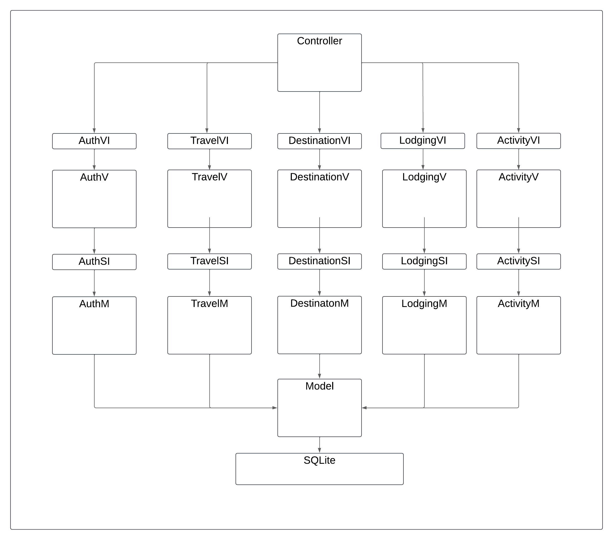

# Sistema de Cadastro de Viagens - Arquitetura de Software

A arquitetura descrita no diagrama segue o padrão MVC (Model-View-Controller), com a adição de camadas intermediárias para desacoplar ainda mais a lógica do sistema. O sistema utiliza o SQLite como banco de dados e possui módulos bem definidos para diferentes funcionalidades, como autenticação, viagens, destinos, hospedagens e atividades. Abaixo, segue uma descrição detalhada de cada camada e seus componentes:

## Camadas e Componentes

### 1. Controller

A camada principal que tem acesso a todas as camadas de apresentação, funciona como um menu para o usuário para navegar pelas telas do sistema, assim como para compartilhar dados entre as telas, como de sessão de usuário.

### 2. VI (View Interface)

Todas as camadas de apresentação compartilham uma interface de apresentação básica, por onde a camada de controle (controller) irá acessar os métodos e dados das camadas de apresentação.

### 3. V (View)

Camada responsável pela interface do usuário e interação direta com o usuário:

- **AuthV**: Tela de autenticação.
- **TravelV**: Tela de viagens.
- **DestinationV**: Tela de destinos.
- **LodgingV**: Tela de hospedagens.
- **ActivityV**: Tela de atividades.

### 4. SI (Service Interface)

Intermediários entre a camada de visualização e a camada de serviço, proporcionando métodos para acessar as funcionalidades da camada de serviço respectiva à camada de apresentação.

- **AuthSI**: Serviço de interface para autenticação.
- **TravelSI**: Serviço de interface para viagens.
- **DestinationSI**: Serviço de interface para destinos.
- **LodgingSI**: Serviço de interface para hospedagens.
- **ActivitySI**: Serviço de interface para atividades.

### 5. M (Model)

Camada responsável pela lógica de negócio e manipulação direta dos dados através de um banco de dados:

- **AuthM**: Modelo de dados para autenticação.
- **TravelM**: Modelo de dados para viagens.
- **DestinationM**: Modelo de dados para destinos.
- **LodgingM**: Modelo de dados para hospedagens.
- **ActivityM**: Modelo de dados para atividades.

### 6. Banco de Dados

- **SQLite**: O banco de dados utilizado pelo sistema. Ele armazena as informações necessárias para todos os módulos de maneira estruturada.

## Fluxo de Dados

O usuário interage com a camada de controle, sendo apresentado opções de telas que o usuário pode navegar, dependendo se está logado ou não.

1. Ao escolher entrar em uma tela, a controladora executa a função de apresentação da tela respectiva passando possíveis dados de sessão de usuário.
2. Ao entrar na tela, ela oferece opções de funcionalidades.
3. Quando uma determinada funcionalidade é escolhida pelo usuário, a tela pode interagir com o usuário para input de dados e em seguida interagir com sua camada de serviço para tomar uma ação com base na funcionalidade e nos dados fornecidos pelo usuário.
4. Ao término da ação, o usuário pode voltar ao menu e navegar por outras telas.

## Módulos

### Autenticação (Auth)

Gerencia o login, registro e autenticação de usuários.

### Viagens (Travel)

Responsável pela criação, leitura, atualização e deleção de dados de viagens do usuário logado, também lista destinos, hospedagens e atividades relacionadas a uma determinada viagem do usuário.

### Destinos (Destination)

Responsável pela criação, leitura, atualização e deleção de dados de destinos do usuário logado.

### Hospedagens (Lodging)

Responsável pela criação, leitura, atualização e deleção de dados de hospedagens do usuário logado.

### Atividades (Activity)

Responsável pela criação, leitura, atualização e deleção de dados de atividades do usuário logado.
